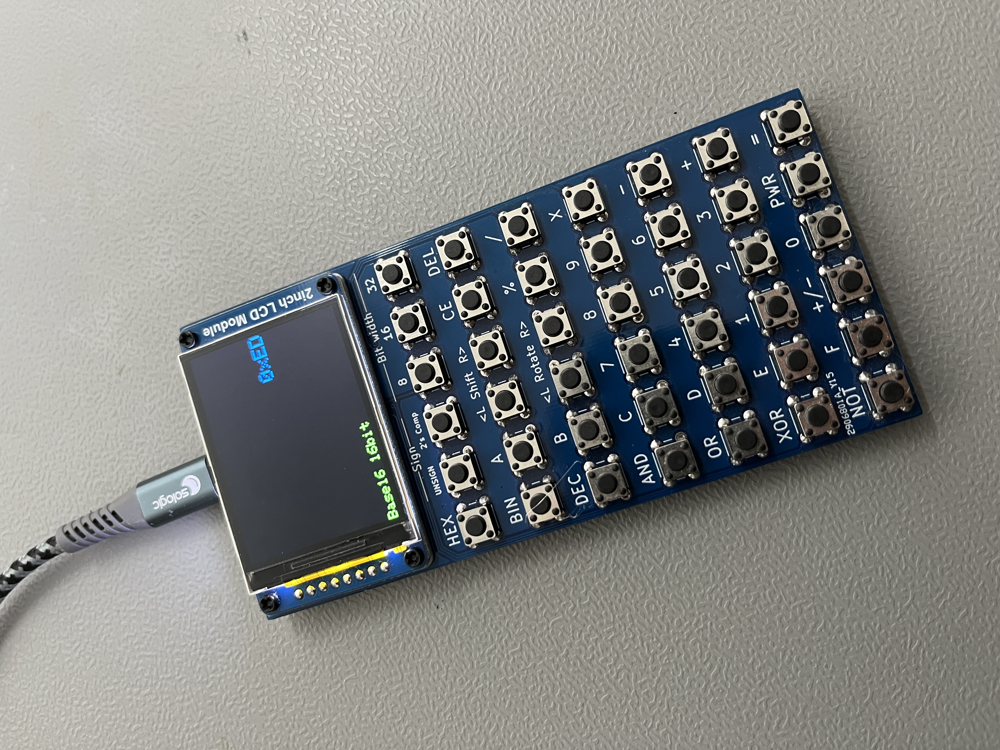

# Barebones AVR m328p based programmer's calculator

I was in need of a no-frills, programmer's calculator, not satisfied with the SwissMicros DM16L clone (which uses RPN), I decided to design my own.
This version powers from a USB micro cable, uses the waveshare 2inch 320x240 color display. Complete insanity, but I like it a lot.

The display is mounted to the PCB using two 2mm plastic screws, using a 3d printed shim as standoff.

The calculator with it's back plate glued on, programming port accessible.